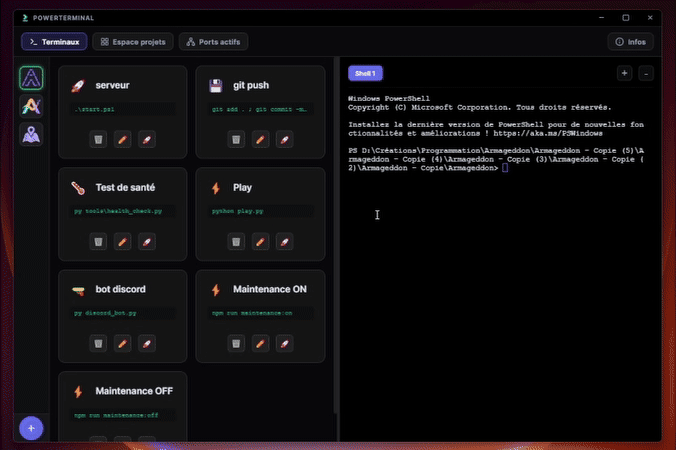
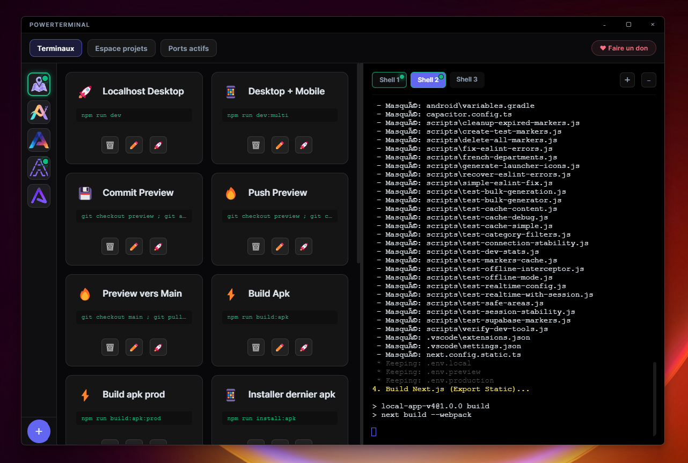
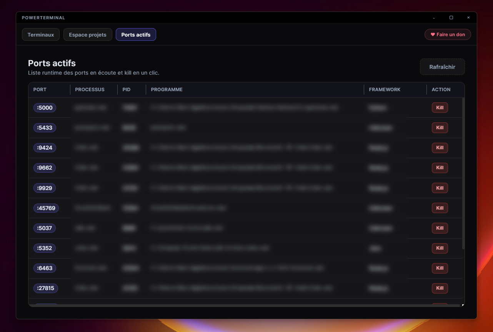

# PowerTerminal

Outil visuel pour gérer plusieurs projets, lancer des commandes instantanément et arrêter les ports bloquants.  
Visual tool to manage multiple projects, run commands instantly and kill blocking ports.

  

## Démo rapide

Ajout d'un projet + lancement de commandes:



## Captures

| Dashboard | Ports actifs |
|-----------|--------------|
|  |  |

## Ce que fait l'app

PowerTerminal sert à piloter rapidement tes projets en local: lancer des commandes, gérer plusieurs terminaux et nettoyer les processus qui bloquent des ports.

### Terminaux (zone principale)

- La colonne de gauche affiche les apps/projets favoris.
- Le bouton `+` en bas à gauche sert à créer des commandes rapides.
- La zone de droite sert à gérer les terminaux de commande (multi-onglets).

### Espace projets

- Tu définis les dossiers racine des projets qui doivent apparaître dans `Terminaux`.
- Tu peux personnaliser le logo de chaque projet.
- Tu peux mettre un projet en favori pour l’avoir directement affiché dans l’espace `Terminaux` au démarrage de l’app.

### Ports actifs

- La page `Ports actifs` permet de voir facilement ce qui tourne sur le PC.
- Tu peux tuer un processus en un clic (`Kill`) pour libérer un port rapidement.
- Les colonnes disponibles: `PORT`, `PROCESSUS`, `PID`, `PROGRAMME`, `FRAMEWORK`, `ACTION`.

## Fonctionnalités clés

- Gestion de projets favoris + ordre personnalisé dans `Terminaux`.
- Multi-shell par projet avec indicateur d'activité réel.
- Commandes custom par projet (emoji, label, commande).
- Monitoring des ports actifs + action `Kill`.

## Stack

- Electron 31
- Vite 5 + `vite-plugin-electron`
- `xterm.js` + `xterm-addon-fit`
- `node-pty`

## Démarrage

```bash
npm install
npm run dev
```

Note Windows: `start-dev.bat` lance aussi le mode dev.

## Build

```bash
npm run build
```

Le build génère un exécutable portable Windows dans `release/`.

## Configuration locale

Le fichier `config.json` est créé automatiquement. Clés principales:

- `rootPath`
- `projectMetadata`

Exemple minimal:

```json
{
  "rootPath": "C:/Users/...",
  "projectMetadata": {
    "C:/mon/projet": {
      "displayName": "Mon Projet",
      "customRoot": "C:/mon/projet",
      "isFavorite": false,
      "logoPath": "C:/mon/projet/logo.png",
      "customCommands": [
        {
          "emoji": "🚀",
          "label": "Dev",
          "command": "npm run dev"
        }
      ]
    }
  }
}
```

`config.json` est local (ignoré par git).

## Structure

```text
PowerTerminal/
├── src/
│   ├── main/
│   │   ├── main.js
│   │   └── preload.js
│   └── renderer/
│       ├── js/app.js
│       └── style/main.css
├── index.html
├── config.json
├── package.json
└── vite.config.js
```

## License
Ce projet est distribué sous licence AGPL-3.0.

---
*Codé 100% par des IA, supervisé à l'arrache par Obat 😏*
